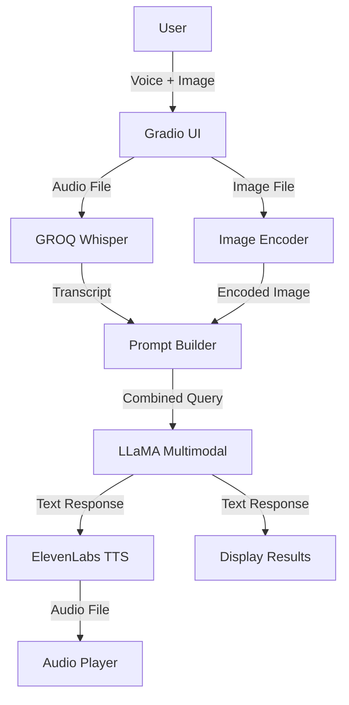

# 🏥 MediAssist AI Doctor

<div align="center">


## Advanced Medical Image Analysis with Voice Interaction Technology
</div>

---

## 📋 Overview

MediAssist AI Doctor is a cutting-edge multimodal medical consultation system that combines voice recognition, medical image analysis, and text-to-speech technology to provide AI-powered medical assessments. This educational platform demonstrates the potential of artificial intelligence in healthcare by allowing users to describe symptoms verbally while uploading medical images for comprehensive analysis.

### ✨ Key Highlights

- **🎤 Voice-Powered Interface** - Speak naturally to describe your symptoms
- **🔍 Advanced Image Analysis** - AI-powered medical image interpretation using LLaMA Vision
- **🔊 Audio Responses** - Natural voice feedback using ElevenLabs TTS
- **⚡ Real-time Processing** - Get analysis results in seconds
- **🎨 Professional UI** - Beautiful, intuitive Gradio interface
- **🔒 Privacy-Focused** - Secure processing of medical data

---

## 🏗️ System Architecture



---

*Complete workflow from user input to AI-powered medical analysis and audio response*

</div>

### Architecture Components

#### **Frontend Layer**
- **Gradio UI**: Modern, responsive web interface for user interactions
- **Input Handlers**: Microphone for voice recording and image upload functionality

#### **Input Processing Layer**
- **GROQ Whisper**: State-of-the-art speech-to-text transcription
- **Image Encoder**: Efficient medical image encoding for AI analysis

#### **Multimodal Reasoning Layer**
- **Prompt Builder**: Combines system prompt with user transcript for context
- **LLaMA Multimodal Model**: Advanced vision-language model for medical image analysis

#### **Output & Storage Layer**
- **ElevenLabs TTS**: High-quality text-to-speech conversion
- **Audio Player**: Seamless playback of AI doctor responses
- **Optional Storage**: Logging capabilities for analysis tracking

#### **Security Layer**
- **Environment Variables**: Secure API key management
- **No Local Storage**: Privacy-first approach with in-memory processing

---

## 🚀 Features

### Core Functionality

| Feature | Description |
|---------|-------------|
| 🎙️ **Voice Recording** | Record symptoms and medical concerns using your microphone |
| 📸 **Image Upload** | Upload medical images (X-rays, scans, skin conditions, etc.) |
| 🤖 **AI Analysis** | Advanced multimodal AI analyzes both voice and image data |
| 📝 **Transcription** | Automatic speech-to-text conversion of symptom descriptions |
| 🩺 **Medical Assessment** | AI-generated preliminary medical assessment and recommendations |
| 🔊 **Voice Response** | Natural-sounding audio playback of doctor's analysis |
| ⚡ **Real-time Processing** | Fast analysis with progress tracking |
| 🎨 **Premium UI/UX** | Beautiful gradient cards with smooth animations |

### Technical Features

- **Multimodal Processing**: Simultaneous analysis of voice and visual medical data
- **Progress Tracking**: Real-time feedback during processing stages
- **Error Handling**: Robust validation and user-friendly error messages
- **Responsive Design**: Works seamlessly across different screen sizes
- **Accessibility**: Clear visual hierarchy and intuitive navigation

---

## 💻 Installation

### Prerequisites

- Python 3.8 or higher
- pip package manager
- API Keys:
  - GROQ API Key (for Whisper speech-to-text)
  - ElevenLabs API Key (for text-to-speech)
  - Access to LLaMA Vision API

### Step 1: Clone the Repository

```bash
git clone https://github.com/yourusername/mediassist-ai-doctor.git
cd mediassist-ai-doctor
```

### Step 2: Install Dependencies

```bash
pip install -r requirements.txt
```

**Required packages:**
```txt
gradio>=4.0.0
groq
elevenlabs
pillow
requests
python-dotenv
```

### Step 3: Configure Environment Variables

Create a `.env` file in the project root:

```env
GROQ_API_KEY=your_groq_api_key_here
ELEVENLABS_API_KEY=your_elevenlabs_api_key_here
LLAMA_API_KEY=your_llama_api_key_here
```

### Step 4: Project Structure

```
mediassist-ai-doctor/
├── app.py                          # Main Gradio application
├── brain_of_the_doctor.py          # Image analysis module
├── voice_of_the_patient.py         # Speech-to-text module
├── voice_of_the_doctor.py          # Text-to-speech module
├── architecture.png                # System architecture diagram
├── requirements.txt                # Python dependencies
├── .env                           # Environment variables (create this)
└── README.md                      # This file
```

---

## 🎯 Usage

### Starting the Application

```bash
python app.py
```

The application will launch at `http://127.0.0.1:7860`

### Using MediAssist

#### Step 1: Record Your Symptoms
1. Click the **microphone icon** in the Voice Input section
2. Clearly describe your symptoms, concerns, and duration
3. Speak naturally as if talking to a real doctor

#### Step 2: Upload Medical Image
1. Click the **upload area** in the Medical Image Upload section
2. Select a clear, well-lit medical image
3. Supported formats: JPG, PNG (max 10MB)

#### Step 3: Submit for Analysis
1. Click the **"🔍 Analyze & Diagnose"** button
2. Wait for the AI to process (with real-time progress updates)
3. Processing typically takes 5-15 seconds

#### Step 4: Review Results
- **Transcription**: See your spoken symptoms in text
- **AI Assessment**: Read the detailed medical analysis
- **Audio Response**: Listen to the AI doctor's explanation

---

## 🛠️ Technologies Used

### AI & Machine Learning
- **LLaMA Vision (meta-llama/llama-4-scout-17b-16e-instruct)**: Multimodal image and text analysis
- **GROQ Whisper (whisper-large-v3)**: High-accuracy speech recognition
- **ElevenLabs**: Premium text-to-speech synthesis

### Framework & UI
- **Gradio 4.0+**: Modern web interface framework
- **Python 3.8+**: Core programming language
- **Custom CSS**: Professional gradient designs and animations

### APIs & Services
- **GROQ API**: Fast inference for speech-to-text
- **ElevenLabs API**: Natural voice synthesis
- **LLaMA API**: Advanced multimodal reasoning

---


## 📝 License

This project is licensed under the MIT License - see the [LICENSE](LICENSE) file for details.
</div>
